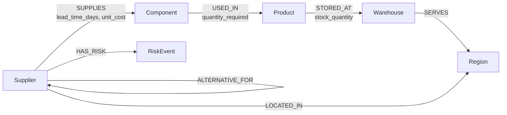

# SupplyShield – Graph-Powered Supply Chain Risk Explorer

SupplyShield helps operations teams understand the business impact of a supplier outage before it becomes a disruption. It models the supply network in CognoDB Cloud and lets users explore dependencies, find single points of failure, and run non-mutating supplier outage simulations.

## Problem statement

Supplier failures rarely stop at one purchase order. A delayed supplier can affect a component, multiple products, warehouse stock, and customer regions. Conventional tabular views obscure this connected impact. SupplyShield presents those relationships as a searchable, explorable graph.

## Key features

- Live resilience dashboard with six graph-derived KPIs and risk overview.
- Supplier search, status and region filters, reliability indicators, and profile drill-downs.
- Product supply-chain explorer with interactive React Flow graph and node detail panel.
- Non-mutating disruption simulator with impact severity, affected products/regions, single-source alerts, and recommended alternatives.
- Idempotent realistic fictional seed data with 20 suppliers, 25 components, 12 products, 5 warehouses, 8 regions, and 8 risk events.
- Typed FastAPI/Pydantic contracts, safe error responses, and parameterized Cypher.

## Technology stack

| Layer | Technology |
| --- | --- |
| Frontend | React, Vite, TypeScript, Tailwind CSS, React Flow |
| Backend | Python, FastAPI, Pydantic |
| Graph database | CognoDB Cloud via official Neo4j Python driver and Bolt |
| Testing | pytest, FastAPI TestClient |

## Why a graph database?

Supplier disruption impact crosses multiple connected entities rather than one isolated table. SupplyShield uses the multi-hop traversal **Supplier → Component → Product → Warehouse → Region** to reveal that ripple effect directly.

Finding active alternate suppliers and identifying single points of failure are relationship-heavy problems: they require examining who supplies the same component, each supplier's region, reliability, and current risk events. A graph model represents those connections natively, so these questions are clearer and more maintainable than deeply nested relational joins across many association tables.

## Graph data model



Every node has an immutable `id` used by `MERGE` during seeding. Relationships carry supply, usage, and inventory attributes.

## CognoDB setup

1. Create a CognoDB Cloud instance and obtain its Bolt URI, username, and password.
2. Copy `backend/.env.example` to `backend/.env`.
3. Fill in the variables below; never commit the resulting `.env` file.

```env
COGNODB_URI=bolt+s://your-instance.cognodb.cloud:7687
COGNODB_USERNAME=neo4j
COGNODB_PASSWORD=replace-with-your-password
```

Optional frontend configuration is in `frontend/.env`:

```env
VITE_API_URL=http://localhost:8000
```

## Local installation and run

Prerequisites: Python 3.11+ and Node.js 20+.

```powershell
# Backend terminal
cd backend
python -m venv .venv
.\.venv\Scripts\Activate.ps1
pip install -r requirements.txt
Copy-Item .env.example .env
# Edit .env with CognoDB Cloud credentials
python seed_data.py
uvicorn app.main:app --reload --port 8000
```

```powershell
# Frontend terminal
cd frontend
Copy-Item .env.example .env
npm install
npm run dev
```

Open `http://localhost:5173`. Demonstration flow: seed database → open Dashboard → navigate to Suppliers → select a supplier → open Simulator → run a disruption simulation → review products and alternative suppliers.

### Seed data

Run this command from `backend/` after setting CognoDB credentials:

```powershell
python seed_data.py
```

The seed routine is repeatable. It uses parameterized `UNWIND $rows` queries and `MERGE` for nodes and relationships, so it updates known records without creating duplicates.

## API summary

| Endpoint | Description |
| --- | --- |
| `GET /health` | API and CognoDB connectivity check. |
| `GET /api/dashboard/summary` | Graph-derived KPI totals. |
| `GET /api/suppliers?search=&status=&region=` | Filtered supplier list. |
| `GET /api/suppliers/{supplier_id}` | Supplier components, risks, alternatives, and product exposure. |
| `GET /api/products` | Product counts and supply-risk level. |
| `GET /api/products/{product_id}/supply-chain` | Product dependency traversal. |
| `POST /api/disruptions/simulate` | Simulate `{ "supplier_id": "SUP-001" }` without writes. |
| `GET /api/risk/single-source-components` | Components with only one active supplier. |
| `GET /api/network` | React Flow/Cytoscape-compatible nodes and edges. |

FastAPI interactive API documentation is available at `http://localhost:8000/docs` while the backend is running.

## Main Cypher queries

- **Supplier list:** aggregates supplied components and open risks from direct relationships while applying optional parameters for search, status, and region.
- **Product supply chain:** traverses product/component/supplier and product/warehouse/region paths in one graph query; the frontend groups the returned paths into an interactive topology.
- **Disruption simulation:** starts at the selected supplier, follows multi-hop component/product/warehouse/region paths, then ranks active alternatives by different region, reliability score, and absence of open high/critical risk.
- **Single-source risk:** counts active `SUPPLIES` relationships per component to detect supply points of failure.

All dynamic values are sent through official-driver query parameters. No user input is concatenated into Cypher.

## Tests and verification

```powershell
cd backend
pytest -q

cd ..\frontend
npm run build
```

Backend tests cover health, dashboard-summary, single-source-component, and disruption-simulation API contracts without requiring live credentials. The frontend production build validates TypeScript and bundling.

## Screenshots

Replace these placeholders with screenshots from your local demo before submission:

| Screen | Placeholder |
| --- | --- |
| Dashboard | `docs/screenshots/dashboard.png` — capture KPI cards and risk overview. |
| Supplier detail | `docs/screenshots/supplier-detail.png` — capture risks and alternatives. |
| Product graph | `docs/screenshots/product-graph.png` — capture interactive traversal. |
| Simulator | `docs/screenshots/simulator.png` — capture a red disrupted node and alternatives. |

Create the `docs/screenshots/` directory, save each image with the listed filename, then replace the placeholder text above with Markdown image links, for example ``.

## Submission links

- Hosted demo: **[Add deployed application URL before submission](https://example.com)**
- Screen recording: **[Add walkthrough recording URL before submission](https://example.com)**
- Source repository: **[Add GitHub repository URL before submission](https://github.com/your-account/supplyshield)**

## Deployment (free hosting)

1. Create a free CognoDB Cloud database and configure its credentials as backend environment variables.
2. Deploy `backend/` to a free Python service such as Render or Railway. Use build command `pip install -r requirements.txt` and start command `uvicorn app.main:app --host 0.0.0.0 --port $PORT`.
3. Seed the deployed database once using the provider shell or a secure local run pointed to the production CognoDB instance.
4. Deploy `frontend/` to Vercel, Netlify, or Cloudflare Pages with build command `npm run build` and output directory `dist`.
5. Set `VITE_API_URL` to the deployed backend URL and add the frontend URL to the backend CORS allowlist in `app/main.py`.

## Known limitations

- The current dashboard risk chart is a compact KPI visualization rather than a historical trend chart.
- The supplied seed data is fictional and intentionally small for a take-home demo.
- CORS origins are configured for localhost; production requires explicit deployed-origin configuration.
- Graph visualization lays out a focused dependency view; very large networks will need pagination, clustering, and server-side limits.
